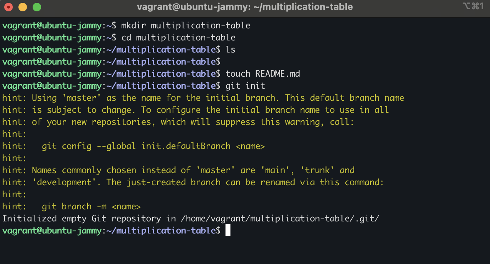
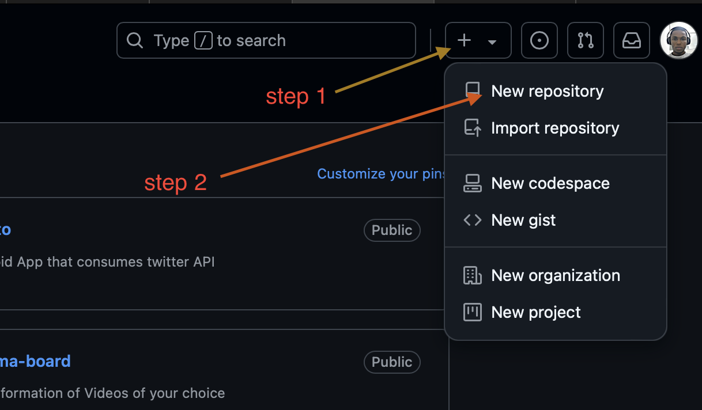
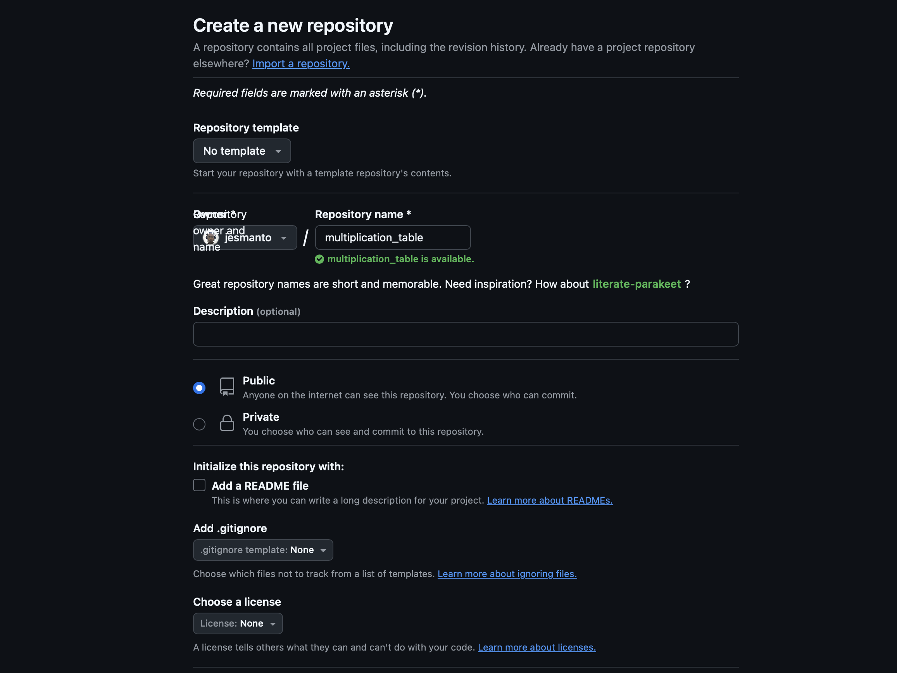
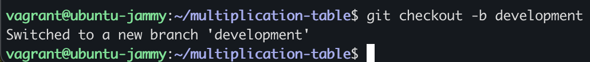
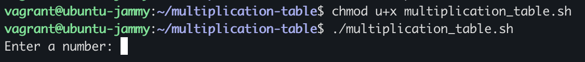
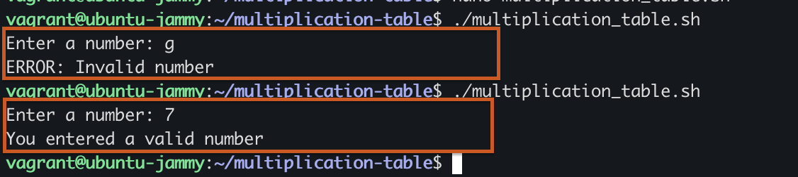
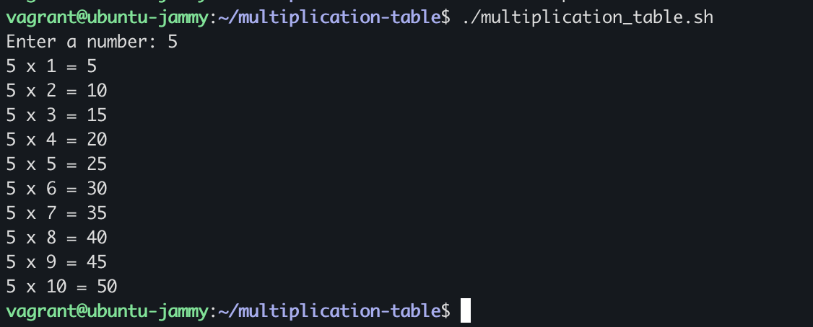
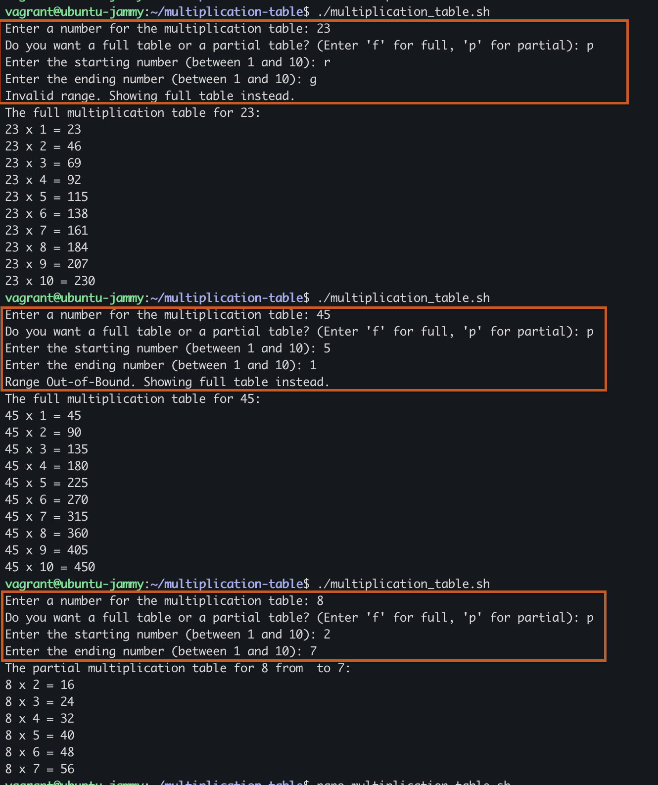
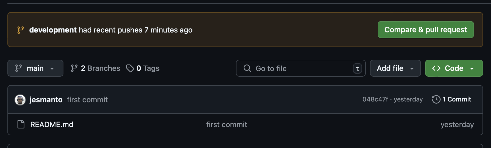
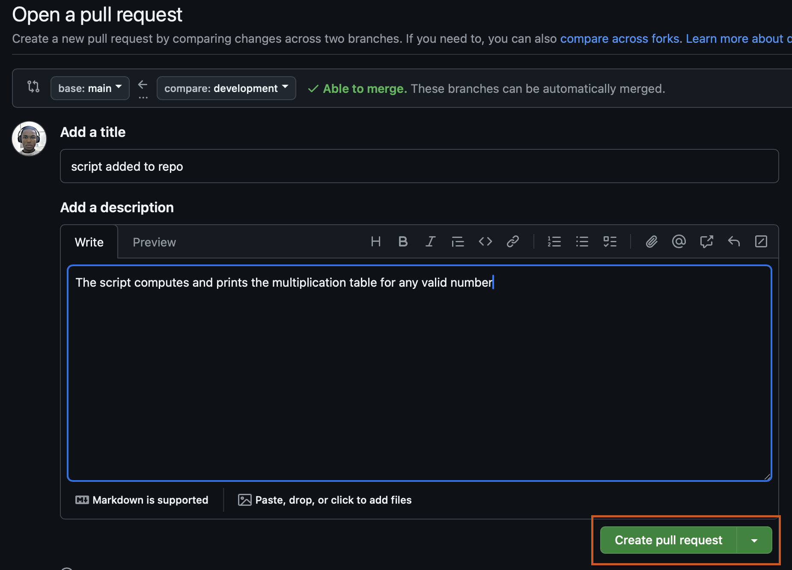

# Multiplication Table
## Step 1: Set up Git
- Open your terminal
- Create a directory "multiplication_table"
    ``` 
    mkdir multiplication_table
    ```
- Navigate into the new directory and Create a README file
    ```
    cd multiplication_table
    touch README.md
    ```
- Initialize git
    ```
    git init
    ```
    

- Confirm git initialization by using `ls -la` command. You should see a `.git` directory

## Step 2: Create a remote repository on Github
- Log into your [Github](https://github.com) account
- Click on the '+' icon at the top-right corner, and select '**New repository**'.

    

- Provide the name and full description of the repository. **Make sure the name is the same as your local directory**

    

## Step 3: Link the remote repository to the local repository (directory)
Enter the following commands below to link your remote repository 

```
git remote add origin git@github.com:jesmanto/multiplication_table.git
git branch -M main
git push -u origin main
```

## Step 4: Create the Multiplication table Script

- Create and checkout to a new branch, `development` branch witht hw following command
    ```
    git checkout -b development
    ```

    

- Create a shell file and name it `multiplication_table.sh`.
    ```
    touch multiplication_table.sh
    ```
- Open the file with a linux text editor like `vi`, `vim`, `nano`, `emacs`, etc. In my case I used `nano`. This can be done with the following command
    ```
    nano multiplication_table.sh
    ```

## Step 5: Compute the full multiplication table of a number
- Start with a Shebang to indicate what type of script your creating. In this case, we are writing a bash script.

    ```
    #!/bin/bash
    ```
- Get user input
    - Prompt the user to enter a valid number

        ```
        read -p "Enter a number: " num
        ```

    - Test on your terminal
        > Make sure to grant execute permision to user before running the script
        ```
        chmod u+x multiplication_table.sh
        ./multiplication_table.sh
        ```
        

- Validate user entry
    - Create a function that validates the user entry to ensure the user doesn't enter an invalid character. This can be don by using a regular expression in a separate function as follows.

        ```
        isValidNumber() {
                [[ "$1" =~ ^[0-9]+$ ]]
        }
        ```
        >$1 represents the first argument passed to function or script

    - Call the function in the IF/ELSE conditional statement
        ```
        if isValidNumber "$num"
        then
                echo "You entered a valid number"
        else
                echo "ERROR: Invalid number"
        fi
        ```
    - Test this on you terminal
        > In the test below, I checked for when the input is invalid and when there is a valid input
        

- Compute tthe full multiplication table
    > Since a multiplication table is a continous and flow of multiplication, we will bw using a loop to go through 1 to 10. You can use either use a C-STYLE or LIST FORM for loop. In my case, I used a **List Form for loop**.
    ```
    if isValidNumber "$num"
    then
            for i in {1..10}; do
                    echo "$num x $i = $((num*i))"
            done
    else
            echo "ERROR: Invalid number"
    fi
    ```
    - Let's test
        

> At this point, the script can now compute the full multiplication table of any valid positive number. Next is to allow the user specify a range they want to see on the multiplication table.

## Step 6: Compute the multiplication table to only show a range of numbers
> If the user enters a valid number, rather than just computing the multiplication table, request the user to input a range, if they don't want the full table. Follow the steps below:
- Request user to specify if the want full or partial multiplication table
    ```
    read -p "Do you want a full table or a partial table? (Enter 'f' for full, 'p' for partial): " range
    ```
- If the user enters anything other the 'p', that means they want it full, just print the full multiplication table
    ```
    if [ $range != "p" ]; then
        # User wants full multiplication table
                echo "The full multiplication table for $num: "

                # Using a List Form forloop for iteration
                for i in {1..10}; do
                        echo "$num x $i = $((num*i))"
                done
    ```
- Else (the user wants a partial multiplication table), ask the user to enter the range of numbers they want:

    ```
    else
        # User wants a partial multiplication table. Ask user for range
                read -p "Enter the starting number (between 1 and 10): " starting
                read -p "Enter the ending number (between 1 and 10): " ending
        fi
    ```

- The `starting` and `ending` vaiables stands for the start and end of the range. So rather than just print out the full table from 1 to 10, we just need to print the multiplication table based on the user entries. The user may enter a wrong character of nothing at all. The block below shows how a wrong entry is handled.

    ```
    else
        # User wants a partial multiplication table. Ask user for range
                read -p "Enter the starting number (between 1 and 10): " starting
                read -p "Enter the ending number (between 1 and 10): " ending

                # User specifies a valid range
                if isValidNumber "$starting" && isValidNumber "$ending"; then

                        # Handle out-of-bound range
                         if [ $starting -lt 1 ] || [ $ending -gt 10 ] || [ $starting -gt $ending ]
                         then
                                 echo "Range Out-of-Bound. Showing full table instead."
                                 echo "The full multiplication table for $num: "

                                 # Using a List Form forloop for iteration
                                 for i in {1..10}; do
                                         echo "$num x $i = $((num*i))"
                                 done
                        else
                                echo "The partial multiplication table for $num from $staring to $ending:"

                                # Using a C-Type forloop
                                for (( i=starting; i<=ending; i++ )); do
                                        echo "$num x $i = $((num*i))"
                                done
                        fi
                else
                # Users range not valid. Show full table instead
                        echo "Invalid range. Showing full table instead."
                        echo "The full multiplication table for $num: "

                        # Using a List Form forloop for iteration
                        for i in {1..10}; do
                                echo "$num x $i = $((num*i))"
                        done
                fi
        fi
    ```

> The block of code above also demonstrates how `out-of-bound` exceptions are handled. These exceptions occur when the user enters valid numbers that are less that 1 or greater than 10.

### Step 6.1. Testing the range seletion

> The image contains three different tests. 
>
>
>
>- The First test demonstrates that the user entered a valid number, and also specified the want to see a partial multiplication table, but enter an invalid range.
>
>- The Second test demonstrates that the user entered a valid number, and also specified the want to see a partial multiplication table, but entered an invalid range where the starting number is greater than the ending. Hence there was an out-of-bound exception.
>
>- The Third test demonstrates that the user entered a valid number, and also specified the want to see a partial multiplication table, and entered a valid range. 

Open the [multiplication_table.sh](./multiplication_table.sh) to see the full script.


## Update github repository
After a successful job, we need to update our github repository.
```
git status
git add .
git commit -m "script added to script"
git push origin development
```

To confirm the update, let's head over to github website.
    

Create a Pull Request
    

>At this point, a senior colleague is assigned to review and merge the pull request to the main branch

Branching back to the main branch and merge locally
```
git checkout main
git pull origin main
```

## Problems Encountered and Solutions
While working on this project, I encountered some setbacks which I'll be talking about in this section. The solutions are attached to each problem. They're are as follows:

- Problems with validation of values entered by a user. Which includes making sure the user entered a number and not a string or any other character.
    >**Solution:** _After lots of research, I resulted in using regular expressions_ `[[ "$1" =~ ^[0-9]+$ ]]`
- Problems with comparison between numbers. I previously used the `=!` sign to check for equalities. This caused me errors during runtime, until I was able to detect the issue.
    >**Solution:** I changed `!=` to `-ne`

## Best Practices
- When working with conditional statements, start with the worst case senerios, to avoid duplicating conditions.
- When checking for equalities, use `==` and `!=` for strings. Also use `-eq` and `-ne` for numbers.
- To get the best from automations, you need to provide enough data for the computer to work with.

## Lessons Learnt
- **Authomation:** _Learnt how to automate processes with several conditions using a bash script_.
- **Arithmetic Operations in Bash Scripting:** _Learnt how arithmetic operations work in Bash Scripting_.
- **Control Flows:** _How to use control flows like forloop (List Form and C-Type) to repeat operations_.
- Learned proper usage of conditional IF/Else statement to make decisions.